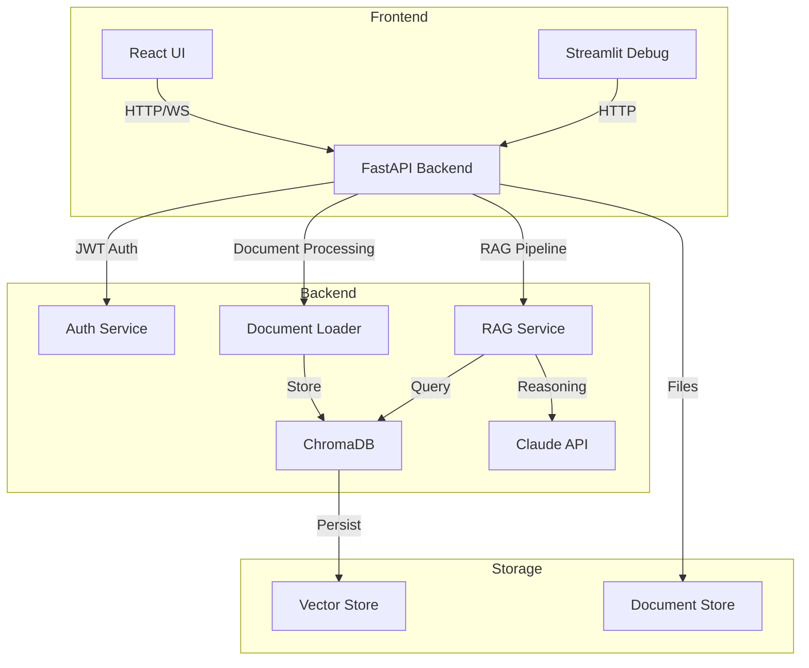

# Notebook LLM

A production-ready multimodal RAG system powered by Claude for analyzing technical documents containing text, images, tables, charts, and code snippets.

## 🌟 Features

- **Multimodal Document Support**

  - PDF, DOCX, CSV, XLSX, PPTX, HTML, Jupyter Notebooks, Markdown, Images
  - Preserves document structure and hierarchy
  - Handles text, images, tables, and code

- **Advanced RAG Pipeline**

  - Claude 3 Sonnet for multimodal reasoning
  - BGE embeddings for semantic search
  - ChromaDB vector store with metadata filtering
  - Hybrid search combining semantic and keyword matching

- **Smart Features**

  - Executive summaries
  - Cross-document relationship mapping
  - Key insights detection
  - Source citations

- **User Interface Options**
  - Modern React frontend
  - Streamlit debug interface
  - Real-time collaboration

## 🚀 Getting Started

### Prerequisites

1. Docker and Docker Compose
2. Anthropic API Key (Claude)
3. At least 8GB RAM recommended

### Environment Setup

1. Clone the repository:

   ```bash
   git clone <repository-url>
   cd notebook-llm
   ```

2. Create `.env` file in the root directory:
   ```env
   ANTHROPIC_API_KEY=your_claude_api_key
   SECRET_KEY=your_secret_key_for_jwt
   ```

### Running the Application

1. Build and start all services:

   ```bash
   docker-compose up --build
   ```

2. Access the interfaces:
   - React UI: http://localhost:3000
   - Streamlit Debug: http://localhost:8501
   - API Documentation: http://localhost:8000/api/docs

### First-Time Setup

1. Create a user account through the API or React UI
2. Upload sample documents through either interface
3. Start asking questions about your documents!

## 📚 Usage Guide

### Document Upload

1. Supported file types:

   - Documents: `.pdf`, `.docx`, `.txt`, `.md`
   - Spreadsheets: `.csv`, `.xlsx`
   - Presentations: `.pptx`
   - Code: `.ipynb`, `.py`
   - Images: `.png`, `.jpg`, `.jpeg`
   - Web: `.html`

2. Size limits:
   - Maximum file size: 50MB
   - Batch upload supported

### Asking Questions

1. Simple text queries:

   ```
   "What are the key findings in the research paper?"
   ```

2. Visual questions:

   ```
   "Explain the trend shown in the chart on page 5"
   ```

3. Code analysis:

   ```
   "What does this function do and what are its parameters?"
   ```

4. Cross-document queries:
   ```
   "Compare the methodologies used in both research papers"
   ```

### Using the React UI

1. Document Management:

   - Upload files via drag-and-drop or file picker
   - View document structure in the sidebar
   - Filter documents by type or date

2. Chat Interface:
   - Ask questions in natural language
   - Attach images for visual queries
   - View source citations
   - Export chat history

### Using the Streamlit Interface

1. Debug Features:
   - Monitor document processing
   - Test different query types
   - View raw API responses
   - Check system performance

## ��️ Architecture

### System Overview



### Backend Services

1. FastAPI Application:

   - `/api/v1/auth`: User authentication
   - `/api/v1/documents`: Document management
   - `/api/v1/query`: RAG pipeline
   - `/api/v1/summaries`: Document analysis

2. Vector Store:
   - ChromaDB for embedding storage
   - Metadata filtering
   - Hybrid search capabilities

### Frontend Components

1. React Application:

   - Material-UI components
   - Real-time updates
   - Responsive design

2. Streamlit Debug Interface:
   - Direct API interaction
   - System monitoring
   - Performance metrics

## 🔧 Configuration

### Environment Variables

```env
# Required
ANTHROPIC_API_KEY=your_api_key
SECRET_KEY=your_secret_key

# Optional
CHROMA_DB_IMPL=duckdb+parquet
PERSIST_DIRECTORY=/chroma/data
```

### API Configuration

```python
# backend/app/core/config.py
SUPPORTED_EXTENSIONS = {
    ".pdf", ".docx", ".csv", ".xlsx",
    ".pptx", ".html", ".ipynb", ".md",
    ".png", ".jpg", ".jpeg"
}

MAX_UPLOAD_SIZE = 50 * 1024 * 1024  # 50MB
```

## 📈 Performance Considerations

- Memory Usage:

  - ChromaDB: 2-4GB recommended
  - Document Processing: 1-2GB per large file
  - Total: 8GB minimum recommended

- Processing Times:
  - Document Upload: 5-30 seconds depending on size
  - Query Response: 2-5 seconds typical
  - Batch Processing: Linear scaling with document count

## 🤝 Contributing

1. Fork the repository
2. Create a feature branch
3. Commit your changes
4. Push to the branch
5. Create a Pull Request

## 📄 License

This project is licensed under the MIT License - see the LICENSE file for details.

## 🙏 Acknowledgments

- Anthropic Claude for multimodal capabilities
- Unstructured for document processing
- ChromaDB for vector storage
- FastAPI for the backend framework
- React and Streamlit for the frontends
